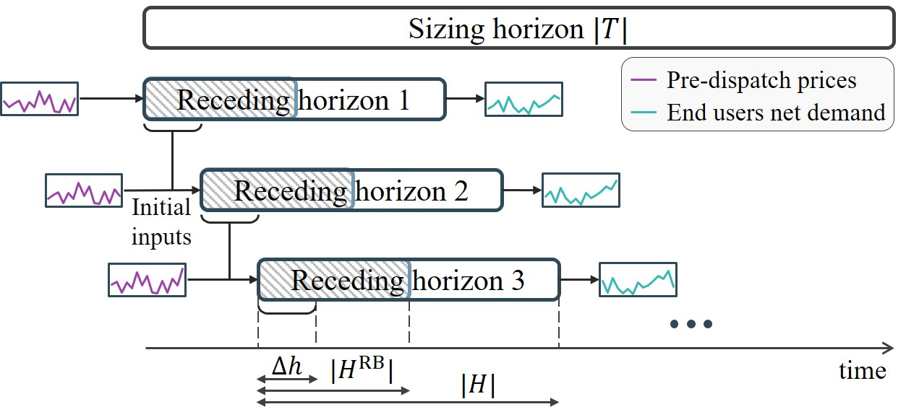
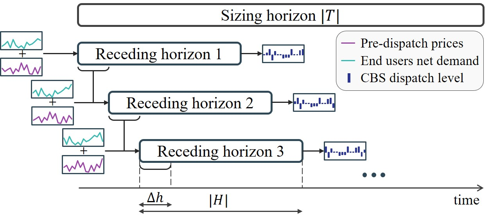

# Community Battery Sizing Study Considering Receding Horizon Operation

## Introduction
This is the repository for the CBS sizing comparison study taking into account receding horizon operation (RHO). A key part of this study is to develop an accurate CBS operation model that continuously adjusts to changes in power system forecasts. The uncertainties include wholesale spot prices and residential users' consumption. While the forecasts of spot prices can be obtained from the pre-dispatch prices published by AEMO, the forecasts of residential users' consumption are not available. Therefore, the study first considers a price-responsive behaviour model of residential elecitricity users to obtain continuously updated residential end-users consumption forecasts. The study then uses the price and consumption forecasts to determine the optimal CBS operation plan in a receding horizon manner. There exists different battery sizing studies in the literature, however, most of them do not consider the RHO operation. The study aims to compare the CBS sizing results with and without RHO operation.

## Usage

### End-users model
The end-users model is implemented in the `prosumer_rho_model.py` file and can be run using the `prosumer_rolling_operation.ipynb` file. The output from the model is the varying consumption behaviour over time.

### CBS operation model
The CBS operation model is implemented in the `battery_rho_model.py` file and can be run using the `battery_rolling_operation.ipynb` file. The model considers the dynamic consumption forecasts of residential users and the dynamic wholesale spot prices forecasts. The output from the model is the optimised CBS operation plan over time.

